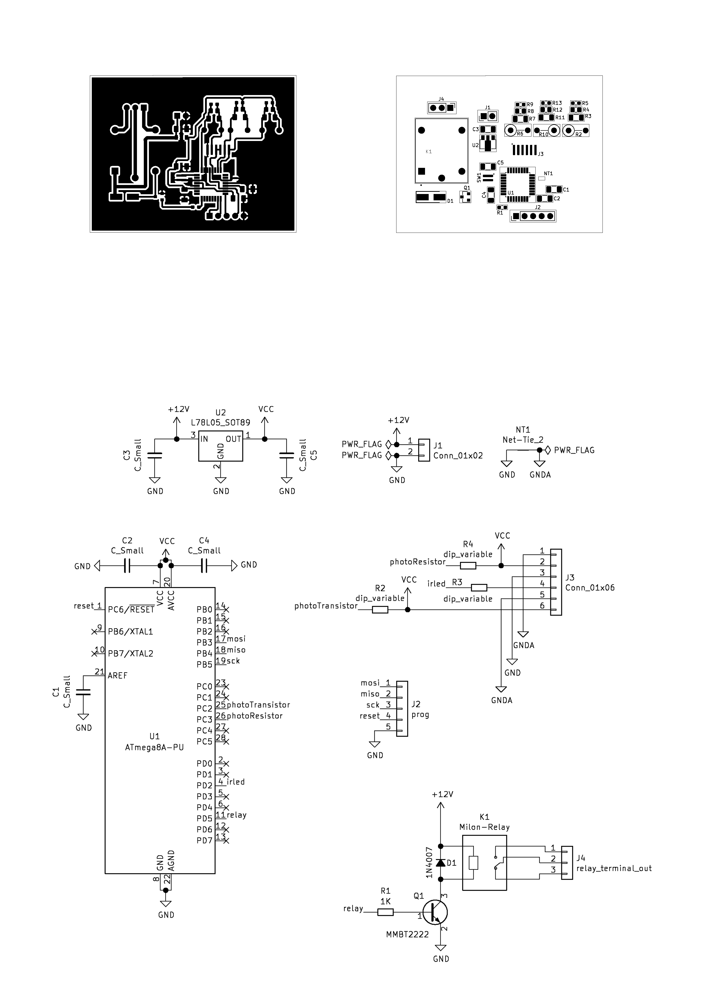

# Hand Sanitizer

Schematics and PCB of an automatic hand sanitizer dispenser. 

The firmware for the microcontroller is in this repo: [Firmware_hand-sanitizer](https://github.com/soystemd/Firmware_hand-sanitizer)

